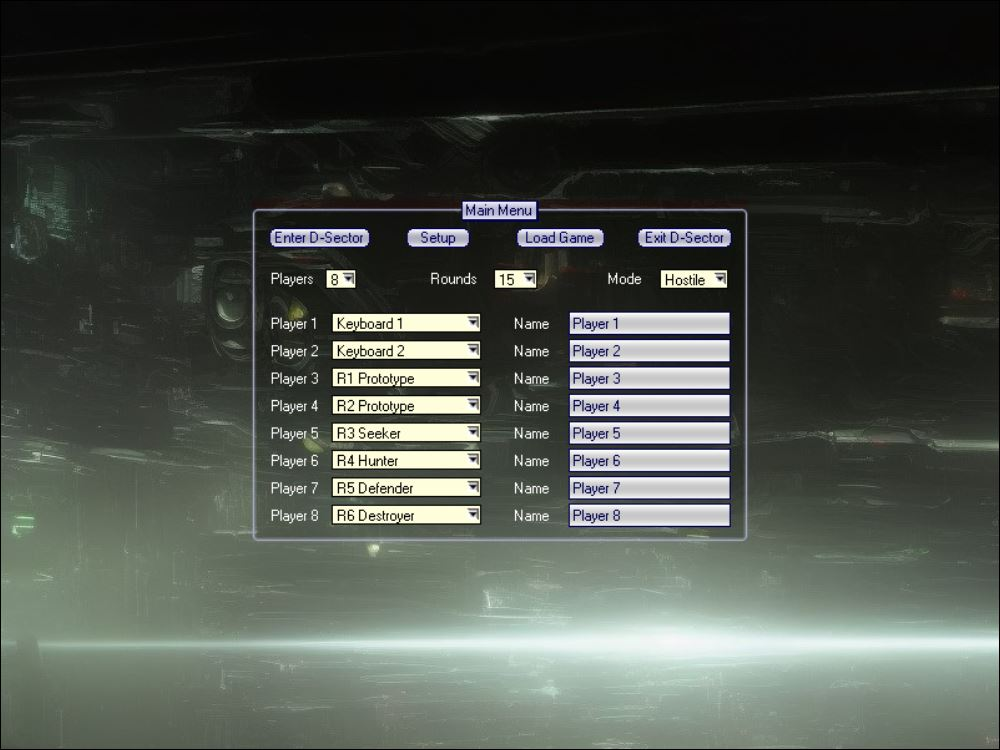

# Destruction Sector

## Contents

1. [About the Game](#About-the-Game)
2. [Main Option Screen](#Main-Option-Screen)
3. [Setup Page](#Setup-Page)
4. [Controls](#Controls)
5. [Saving Game](#Saving-Game)
6. [Scoring System](#Scoring-System)
7. [Shopping Screen](#Shopping-Screen)
8. [Statistics Board](#Statistics-Board)
9. [Item Information](#Item-Information)
    1. [Tanks](#Tanks)
    2. [Weapon Ports](#Weapon-Ports)
    3. [Weapon Descriptions](#Weapon-Descriptions)
    4. [Tools](#Tools)
10. [Robots](#Robots)

# About the game

Destruction Sector is an arcade/strategy science fiction tank war game compatible with all modern web browsers.

Presented in a top-down 3D view, the game features triangular tanks battling in randomly generated arenas.
Players can choose from various game modes, including Hostile and Teams, and upgrade their tanks with a range
of enhancements. While the game is largely intuitive and easy to pick up, this manual offers additional insights and
highlights features that may not be immediately apparent during gameplay.

It is a port from the Java-based version of a similar game.

# Main Option Screen

The main option screen has a nice sci-fi background which allows the following to be configured:
- the human and robot players.
- the number of rounds
- the play mode

There are many ways to play by combining multiple human players and robots.
If you are playing with more than one person and everyone feels too squashed using the same keyboard
then you may want to plug in external USB keyboards or game pads for each additional player.

## Hostile Mode

In HOSTILE mode, everyone is the enemy of everyone else. Points and shopping credits are
awarded in proportion to the damage done, with a score of 100 being the maximum damage
that can be made to a single tank (without players recharging their shields). Six shopping
credits are awarded for each unit of damage done.

## Teams Mode

In TEAMS mode players are grouped into two teams and each team must try to destroy the
jewel protected by the opposite team. Personal scores and credits are earned in the same
way as HOSTILE mode however the team's score is purely associated with the total damage
made to the enemy's jewel. See the section SCORING below for more details.

# Setup Page

The setup page can be reached by clicking the 'SETUP' button from the main option screen.
This page allows you to customize various game settings to enhance your gameplay experience.

If you do not like the default tank controls, you can redefine them for any of the players on the SETUP screen.
The available game options that can be changed in SETUP include:

1. Re-defining tank control keys for keyboard players.
    - Customize the movement and action keys for up to four different keyboard configurations, enabling multiple players
      to play on the same computer.
    - Assign keys for actions such as moving forwards, moving backwards, turning left, turning right, firing, and
      changing weapons.
2. Choosing the Kind of Sound to be Used:
    - Select between different sound effect settings, such as "Extended Sound" for enhanced audio experience.
    - Toggle the background music on or off according to your preference.
3. Simplifying Rendering Options to Increase Frame Rate for Slower Machines: (The whole game is slow in general)
    - Adjust rendering settings like anti-aliasing to improve performance on slower machines.
    - Disable or enable the magnetic grid overlay to manage visual complexity.
4. Defining the default view mode:
    - Choose the default camera mode for how you view the game environment, such as the "D-Sector Standard Display" or "
      Cyclic display" mode.
5. Starting credits:
    - Define the amount of in-game currency or points players start with.
    - Options include:
        - `Default`: This setting is balanced for a typical gameplay experience, providing a fair challenge without any
          significant advantages or disadvantages.
        - `Fun`: Begin the game with double amount of credits over the `Default` option. This setting is designed to
          make the game more enjoyable and allowing for a more entertaining experience.
        - `OVERPOWERED!` provides a significant boost to the starting credits players will start with and will ensure
          maximum destruction.

The game pads have a default bindings that can't be changed. This is explained futher in the next section.

All of the options, except for the keyboard controls, can also be changed in the middle of play by right-clicking
over the playfield. This allows you to make on-the-fly adjustments to suit your gameplay needs without having
to exit the current session.

# Controls

This is the default game controls scheme used while playing the game:

| Action        | Player 1 | Player 2 | Player 3 | Player 4 | Game pad+ |
|---------------|:--------:|:--------:|:--------:|:--------:|:--------------------:|
| Move forward  |    UP    |    W     |    T     |    I     |         D-Up         |
| Move backward |   DOWN   |    S     |    G     |    K     |        D-Down        |
| Rotate left   |   LEFT   |    A     |    F     |    J     |        D-Left        |
| Rotate right  |  RIGHT   |    D     |    H     |    L     |       D-Right        |
| Fire weapon   |  Space   |    Q     |    R     |    U     |          A           |
| Change weapon |    C     |    E     |    Y     |    O     |          B           |

+Although the game pads bindings can't be changed, they are intuitive enough to use.
Both analogue controls and digital controls have been set up as options for movement and control of the tank.
**For example**: on an XBox 360 controler, the left stick can rotate the tank, while the trigger buttons will accelerate
and reverse the tank. The D-Pad directions will function as the appropriate movement commands.
The `A` button is used to fire your weapon and `B` is used to change weapon.

If you want to end the round press `ESC`. This can be used when computer players become stuck after all
human players are out. By pressing `ESC`, the remaining players receive a predicted score and credits
bonus depending on the amount of weapon energy and shield energy each tank has. Living human
players are assumed to be destroyed when `ESC` is pressed, so they get no bonus. Only use this
option to quickly get to the shopping menu to save the game or when the robots are taking too long to finish the round.

# Saving the Game

*To be implemented as of 2024-07-23*  
The game can be saved from the shopping screen. If you need to save the game suddenly while you are
playing then you will need to press ESC to end the rounds until the next shopping screen appears.

Saving the game involves clicking the 'Save Game' button entering a save game name in the text box, then clicking the '
Save' button.

# Scoring

## Tank Points - Teams Mode and Hostile Mode

**DAMAGING A TANK**

- Credits Earned:
    - 1 point for every unit of damage inflicted (up to 100 points)
    - 6 credits for every unit of damage inflicted (up to 600 credits)

A tank takes 100 units of damage to be destroyed, so 100 points can be earned for a complete kill.
Hitting a tank with strong armour means that each hit does less damage, and consequently, fewer credits earned per hit.
Therefore, it's more efficient to target tanks with weaker armour first to maximize your weapon energy.

In team mode, additional tank points are earned for firing at the enemy jewel.
It's strategic to attack the jewel while it’s slowing down, especially after all enemy tanks have been destroyed.

If a tank is close to being destroyed, it's more economical to finish it off with a less powerful and cheaper weapon.

## TEAM POINTS - TEAMS MODE ONLY

**DAMAGING A JEWEL**

- 1 point for every unit of damage inflicted (up to 200 points)
- 6 creditsw for every unit of damage inflicted  (up to 1200 credits)

A team earns 1 point for every unit of damage done to the enemy's jewel, up to 200 points.
The jewel continually takes damage after all members of the team are out.
No team points are earned for damaging or destroying enemy tanks, although tank points are still awarded for this.

The team leader is the player who has the highest tank score.
Tank points are neither lost nor gained for firing at members of the same team.

# Shopping Screen

Every three rounds, players can visit the shop to buy weapons and other items.
Players earn six credits for every unit of damage inflicted, whether on tanks or jewels.
This translates to a maximum of 600 credits for destroying a tank and 1200 credits for completely destroying a jewel.

Information about each item can be found by clicking the `i` button, allowing players to compare value for credits
diligently.
D-Sector will test your aptitude in economics and saving. The best players will make use of inexpensive weapons,
carefully avoid missing, and purchase more expensive weapons only after acquiring tanks with
higher weapon fuel ratings and weapon fuel upgrades.

When purchasing a weapon, it's important to consider both the damage/fuel ratio
(which indicates how powerful the weapon is in battle) and the damage/cost ratio
(which closely relates to the profit you can make using the weapon).

Membership to the shop can be purchased for 3,000 credits, granting members a 25% discount on all items for the rest of
the game.
Occasionally, there will be an annoucement for special discounts on overstocked items, and a temporary price increase
for items that are in low on stock.

Robots will shop as carefully as they can and may also purchase a shopping card.
Robots will be exposed to the same special discounts announced to human players,
and you can hear when the robots are upgrading their tanks.

# The Statistics Board

The statistics board is shown every 15 rounds and at the end of the game. The information is mostly self explanatory.
The 'damage/fire ratio' represents the firing efficiency, hence a low value is given to the players who use low-damage
weapons or often miss the target.
The tank specifications will show the exact effect that any purchased tank upgrades had.

# Item Information

There are various types of items, including tanks, weapons, tools, and upgrades.
While some special weapons may initially seem overpriced, each one serves a unique purpose in the game.
Using them effectively may require a bit of creativity.
The provided descriptions often contain valuable hints and ideas.

## Tanks

Each tank has four attributes: Speed (forwards and backwards), rotational speed, armour and weapon fuel quality.
The weapon fuel quality is very important because it effects the amount of damage that each weapon does and
so a tank with higher weapon fuel quality will not only win more rounds but also allow you to save credits more
effectively.

Upgrades for weapon fuel quality, rotation, speed, and armour can be purchased at the same price as
the tank (level II upgrades are twice the price of the tank). If you have bought upgrades for a tank and
then buy a new tank, the upgrades are NOT carried across to the new tank.
It is sometimes more appropriate to maintain a less expensive tank and purchase upgrades and tank purchasing
decisions depend very much on how many rounds are being played.

### Standard Tank

This is the tank that all players begin with.

| Weapon Fuel Quality (WF) | Shield (SH) | Rotation (ROT) | Speed (SP) | Price |
|:------------------------:|:-----------:|:--------------:|:----------:|:-----:|
|            10            |      3      |       3        |     8      | 2,000 |

### Rotra I

This 'Rotation Tank' was the first non-standard tank used for combat.
It has a very compact size, much better rate of rotation and improved armour.
The turn rate is even better than the most expensive OPEC 2 tank.

| Weapon Fuel Quality (WF) | Shield (SH) | Rotation (ROT) | Speed (SP) | Price |
|:------------------------:|:-----------:|:--------------:|:----------:|:-----:|
|            10            |     3.5     |       5        |     9      | 4,000 |

### Rotra II

The improved version of the compact Rotra I was designed for even better
maneuverability and supports a higher weapon fuel quality. The Rotra II
allows a skillful controller to dodge missiles rather than relying on shield
strength

| Weapon Fuel Quality (WF) | Shield (SH) | Rotation (ROT) | Speed (SP) | Price |
|:------------------------:|:-----------:|:--------------:|:----------:|:-----:|
|            11            |     3.5     |       5        |     10     | 6,000 |

### Opec I

The expensive Opec series were designed for faster velocity and significantly
improved shielding. Note however that the Opec I is less compact than the
Rotra I and Rotra II tanks and arguably less maneuverable. Most of what you
are paying for is the higher fuel quality.

| Weapon Fuel Quality (WF) | Shield (SH) | Rotation (ROT) | Speed (SP) | Price |
|:------------------------:|:-----------:|:--------------:|:----------:|:-----:|
|            12            |      4      |       4        |     11     | 9,000 |

### Opec II

A high price is required for the Opec II - slightly faster and more damaging
than the original Opec although with the same armour and turning rate.
An Opec II with level 1 and level 2 Fuel Upgrades can mean the beginning of the end for the other players.

| Weapon Fuel Quality (WF) | Shield (SH) | Rotation (ROT) | Speed (SP) | Price  |
|:------------------------:|:-----------:|:--------------:|:----------:|:------:|
|            13            |      4      |       4        |     12     | 12,000 |

### Opec X

An experimental high performance tank design.
All base stats are higher than the **Opec II** and is considered the next evolution to the Opec line of tanks.

| Weapon Fuel Quality (WF) | Shield (SH) | Rotation (ROT) | Speed (SP) | Price  |
|:------------------------:|:-----------:|:--------------:|:----------:|:------:|
|            14            |     4.2     |       5        |     13     | 18,000 |

# Weapon Ports

Each tank is equipped with six weapon ports, each designated for a specific type of weapon.
The first port is reserved for missile weapons, the second for lasers, and so on. Weapons are sold in units of 100,
but their firing rates vary significantly — some, like Glow Shields, are used less frequently than others, such as
Swirlers.
This variation in firing rates should be considered when evaluating prices.

When purchasing new weapons, be cautious as they will replace any number of existing weapons
in the same port without prior notice. To maximise efficiency, it's advisable to deplete the
existing weapons in a port almost entirely before introducing new ones.

## Weapon Descriptions

### Port 1 (Missile Fire)

#### Single Missile

This is the weapon that all tanks start with. It is sometimes bought as a low priced backup weapon,
and its ability is often underestimated, considering the negligible price

| Abbreviation | Damage | Weapon Energy Used | Price |
|:------------:|:------:|:------------------:|:-----:|
|      SM      |   4    |         4          |   2   |

#### Double Missile

Improve the power of the standard missile without using any more energy.
The low price makes this a good weapon for saving credits.

| Abbreviation | Damage | Weapon Energy Used | Price |
|:------------:|:------:|:------------------:|:-----:|
|      DM      |   6    |         4          |  200  |

#### Triple Missiles

The Triple Missile is the next step after the Double Missile.
Due to its slow speed and high damage, this weapon is best used for close range combat.

| Abbreviation | Damage | Weapon Energy Used | Price |
|:------------:|:------:|:------------------:|:-----:|
|      TM      |   9    |         4          | 1,200 |

#### Tri Breaker

A great starting weapon due to a very high damage per unit cost.
On second firing the missile splits up into three, each able to do 8 units of damage.
Like all breaking weapons (Breakers, Blasters and Bombs) a direct hit will only do half of the maximum damage.

| Abbreviation | Damage | Weapon Energy Used | Price |
|:------------:|:------:|:------------------:|:-----:|
|      TB      |   24   |         12         |  300  |

#### Quint Breaker

These work the same way as the Tri Breakers, except releasing five
missiles instead of three, each doing eight units of damage - good
value for credits.

| Abbreviation | Damage | Weapon Energy Used | Price |
|:------------:|:------:|:------------------:|:-----:|
|      QB      |   40   |         12         | 1,500 |

#### Octo Breaker

The Octo Breaker is the next level up from the Quint Breaker.
It will only take a few good hits to destroy any tank.
Because of the high price, the players must be careful not to miss their target
in order for there to be a pay-off for those wishing to save credits.

| Abbreviation | Damage | Weapon Energy Used | Price |
|:------------:|:------:|:------------------:|:-----:|
|      OB      |   64   |         12         | 8,500 |

#### Guided Missile

This missile will turn towards the closest tank that is moving.
It only requires approximate aiming to hit the target although the missile
can be avoided at times by momentarily staying completely still.
Since it has a poor damage / energy ratio, guided missiles are mostly valuable to the lesser skilled players

| Abbreviation | Damage | Weapon Energy Used | Price |
|:------------:|:------:|:------------------:|:-----:|
|      GU      |   6    |         6          |  400  |

### Port 2 (Laser Fire)

#### Beam Laser

Like all the low priced weapons, it is a good idea to get used to using the Beam Laser.
Although the expensive weapons may do more damage, you are not necessarily making more credits for
every unit of damage done -> Master the low priced weapons.

| Abbreviation | Damage | Weapon Energy Used | Price |
|:------------:|:------:|:------------------:|:-----:|
|      BL      |   6    |         6          |  300  |

#### Power Laser

Power Lasers fire two Beam Lasers while using up the energy of only one.
It can be used for aiming at a specific enemy rather than whomever is closest.

| Abbreviation | Damage | Weapon Energy Used | Price |
|:------------:|:------:|:------------------:|:-----:|
|      PL      |   12   |         6          | 1,650 |

#### Tri Striker

The Tri Striker are three Bream Lasers in one - very energy efficient but
requiring great aiming skills when used in long range firing.
With the relatively high price you cannot afford to miss very often if you want a return on your investment.

| Abbreviation | Damage | Weapon Energy Used | Price |
|:------------:|:------:|:------------------:|:-----:|
|      BL      |   18   |         6          | 3,350 |

### Port 3 (Alternative Fire)

#### Rear Double

Two missiles are fired parallel out from the rear of the tank.
The weapon makes a good surprise attack, and has a strangely low price considering the damage damage it does.

| Abbreviation | Damage | Weapon Energy Used | Price |
|:------------:|:------:|:------------------:|:-----:|
|      RD      |   8    |         5          |  250  |

#### Rear Guided

The Rear Guided releases two guided missiles from the rear,
each doing four units of damage. Very good for attacking while being chased

| Abbreviation | Damage | Weapon Energy Used | Price |
|:------------:|:------:|:------------------:|:-----:|
|      RG      |   8    |         5          |  650  |

#### Rear Triple

The Rear Triple is the improved version of the Rear Double,
doing nearly twice the damage for the same energy use.
It can be a good alternative to the Tri Striker.

| Abbreviation | Damage | Weapon Energy Used | Price |
|:------------:|:------:|:------------------:|:-----:|
|      RT      |   15   |         5          | 2,400 |

### Port 4 (Advanced Weaponry)

#### Blaster

Blasters use a 'double fire' system, where the first shot launches the warhead and
the second shot breaks the warhead into a group of missiles.
The warheads deal half of their maximum damage when they hit a tank or jewel directly.
Unlike the Breaker family of weapons, Blasters split in all directions, making it challenging to achieve maximum damage.

| Abbreviation | Damage | Weapon Energy Used | Price |
|:------------:|:------:|:------------------:|:-----:|
|      BL      |  120   |         30         | 2,500 |

#### Guided Blaster

The Blaster with a guided warhead is ideal for desperate situations
where there's no time for careful aiming, or for those who struggle with accuracy.

| Abbreviation | Damage | Weapon Energy Used | Price |
|:------------:|:------:|:------------------:|:-----:|
|      GB      |  120   |         30         | 3,200 |

#### Blast Guider

The Blast Guider has the opposite effect of the Guide Blaster.
It is a standard warhead that disperses into a cluster of highly effective guided missiles.
In open areas or with strategic deployment, it can achieve maximum damage, making it a highly cost-effective weapon.

| Abbreviation | Damage | Weapon Energy Used | Price |
|:------------:|:------:|:------------------:|:-----:|
|      BG      |   60   |         30         | 3,200 |

#### Blast Swirler

On second firing, the warhead will split into eight Swirlers, each doing ten units of damage.
As with all other double fire weapons a direct hit will only yield half damage.
The debris from Blast Swirler will swirl around for a long time and, with careful use,
near maximum damage can often be obtained.

| Abbreviation | Damage | Weapon Energy Used | Price |
|:------------:|:------:|:------------------:|:-----:|
|      BS      |   80   |         30         | 4,500 |

#### Nuke Blaster

This is the big version of the standard Blaster.
It only takes two or three, and with a highly upgraded tank sometimes only
one good hit to completely destroy a fully shielded tank.
Since the weapon is not fired many times, it ends up being very good value, but must be aimed carefully.

| Abbreviation | Damage | Weapon Energy Used | Price  |
|:------------:|:------:|:------------------:|:------:|
|      NB      |  280   |         30         | 20,000 |

#### Spark Fiends

You will not save much credits with this weapon, but it can be used to
quickly kill off unshielded rivals in open areas before they can even score their first point.
By staying completely still the Spark Fiends will ignore you.

| Abbreviation | Damage | Weapon Energy Used | Price |
|:------------:|:------:|:------------------:|:-----:|
|      SF      |   24   |         5          | 7,500 |

#### Swarm Missile

The Swarm Missile is designed for critical moments when precision is paramount.
The second shot will break it up into 16 guided missiles, each homing in on targets to ensure maximum impact
even in chaotic battle scenarios. Each missile will inflict the same amount of damage as a Standard Missile.
It is ideal in situations where hitting multiple targets is essential as
the small missiles will go for the closest target when launched.

| Abbreviation | Damage | Weapon Energy Used | Price |
|:------------:|:------:|:------------------:|:-----:|
|      SM      |   50   |         18         | 3,200 |

### Port 5 (Aggressive Defense)

#### Swirler

A missile is released which swirls around the tank with the swirling radius gradually expanding.
Swirlers are usually fired in large numbers to get rid of touching or chasing tanks.
Robots often avoid firing through Swirlers so they can also be used to form a protective wall.

| Abbreviation | Damage | Weapon Energy Used | Price |
|:------------:|:------:|:------------------:|:-----:|
|      SW      |   4    |         3          |  250  |

#### Electro Buds

Seven slow moving missiles are released, each with a guiding system.
When fired in large numbers they can act as a 'deadly mist'.

| Abbreviation | Damage | Weapon Energy Used | Price |
|:------------:|:------:|:------------------:|:-----:|
|      EB      |   7    |         3          |  900  |

#### Bomb

Bombs are used by firing once to release the bomb and firing a second time to detonate it.
You can release the bomb and then change weapons without detonating the bomb and then change your
weapon back to the bomb to detonate it.  
Like Breakers and Blasters, Bombs will do half of their maximum damage if a tank
comes into direct contact with the warhead. Sometimes they can be dropped in a place where
the enemy is forced to move over or used to manipulate the movement of robots.

| Abbreviation | Damage | Weapon Energy Used | Price |
|:------------:|:------:|:------------------:|:-----:|
|      BO      |  100   |         20         | 1,000 |

#### Death Bomb

These bombs will usually destroy anything that moves over them during detonation and
a close range explosion will do enormous damage.
This weapon provides a super return on investment if used carefully.

| Abbreviation | Damage | Weapon Energy Used | Price |
|:------------:|:------:|:------------------:|:-----:|
|      DB      |  300   |         20         | 8,000 |

### Port 6 (Defense)

#### Glow Shield

Glow Shields provide complete protection for a few seconds, making them perfect for
escaping close-quarters combat, securing passage around walls, or attacking safely.
However, they are less effective for prolonged attacks since weapon energy does not fully recover while the shield is
active.
To prevent robots from using the Glow Shield, allow them to fire at you and
dodge their attacks until their weapon energy is depleted.

| Abbreviation | Damage | Weapon Energy Used | Price |
|:------------:|:------:|:------------------:|:-----:|
|      GS      |   0    |         15         | 2,500 |

#### ECM Hacker

The Hacker destroys missile within a few tank lengths from your own tank.
Highly experienced players will even have some success using Hackers against laser fire.

| Abbreviation | Damage | Weapon Energy Used | Price |
|:------------:|:------:|:------------------:|:-----:|
|      EH      |   0    |         3          |  200  |

#### ECM Wiper

The Wiper destroys every missile in the zone.
It can be used to aid a friend in teams mode or waste the weapon energy and reduce the savings of your enemies.

| Abbreviation | Damage | Weapon Energy Used | Price |
|:------------:|:------:|:------------------:|:-----:|
|      EW      |   0    |         3          |  400  |

#### Teleport Self

This device is useful for escaping from desperate situations or for freeing yourself when stuck.
It uses very little energy when its fantastic power is considered. It can also be useful in Teams mode.

| Abbreviation | Damage | Weapon Energy Used | Price |
|:------------:|:------:|:------------------:|:-----:|
|      TS      |   0    |         4          | 2,000 |

#### Teleport Foe

This forces the nearest tank to be teleported to a random location.
It is useful for escaping a closing tank, or for separating two tanks
in close combat which are wasting your 'potential points'.

| Abbreviation | Damage | Weapon Energy Used | Price |
|:------------:|:------:|:------------------:|:-----:|
|      TF      |   0    |         4          | 2,000 |

#### Heal

The Healers convert weapon energy to shield energy.
This Healer is only used when the player has excess weapon energy but is critically down on shields.

| Abbreviation |         Damage         | Weapon Energy Used | Price |
|:------------:|:----------------------:|:------------------:|:-----:|
|      HE      | Adds 10 Sheild to self |         10         | 2,000 |

#### Death Touch

This weapon inflicts instant damage to any target within a small radius around the tank.
It's a cost-effective backup weapon that can destroy tanks in just a few hits.
Most effective when used to corner an enemy against a wall and/or an ally,
preventing their escape and limiting their ability to manoeuvre away.

| Abbreviation | Damage | Weapon Energy Used | Price |
|:------------:|:------:|:------------------:|:-----:|
|      DT      |   16   |         7          |  350  |

### Tools

#### Tank Upgrades

You can buy tank upgrades involving weapon fuel quality, speed, rate of rotation and armour.
When a new tank is purchased the previous upgrades are lost. Level I upgrades are the same price as tank being
upgraded and Level II upgrades are available at twice the tank price.
The Fuel Upgrade is highly desirable because it increases the damage that
all weapons do without increasing their cost or energy use and this allows you to save credits more effectively.

|     Type      | Level I Price  |     Level II Price |
|:-------------:|:---------------|-------------------:|
| Fuel Upgrade  | `cost of tank` | `2 * cost of tank` |
| Metal Upgrade | `cost of tank` | `2 * cost of tank` |
| Speed Upgrade | `cost of tank` | `2 * cost of tank` |
| Turn Upgrade  | `cost of tank` | `2 * cost of tank` |

|     Item      | Price | Description                                                                                                                                                                                                                                                                                                         |
|:-------------:|:-----:|:--------------------------------------------------------------------------------------------------------------------------------------------------------------------------------------------------------------------------------------------------------------------------------------------------------------------|
| Shopping Card | 3,000 | The common shoppers can buy a D-Zone discount membershipand receive all items for only 75% the original price - a definite requirement for the long round games.                                                                                                                                                    |
|  Score Bribe  | 5,000 | This is normally used to convert your residual money into points just before the end of the game.                                                                                                                                                                                                                   |
| Larger Death  | 8,000 | This allows the tank's explosion to do twenty times more damage than usual. Enormous damage can be done by positioning the tank side-by-side with the enemy, forming a rectangle before being destroyed.                                                                                                            |
| Fast Recharge | 7,000 | Increases the weapon recharge rate by 25%. If you have many rounds left, save up for this.                                                                                                                                                                                                                          |
|  Auto Healer  | 6,000 | The Auto Healer enables your shields to regenerate automatically over time. Unlike weapon energy, shield regeneration depends on energy received from nearby tanks. Hiding far from enemies yields minimal regeneration, while staying close to them, whether navigating or in combat, provides a slight advantage. |

# Description of Robot Tanks

## R1 Prototype

These tanks are very slow thinkers and also rather nervous, so they only dare attack the tank with the lowest score.
Don't be too hard on them.

## R2 Prototype

Improved version of the R1 Prototype. These tanks will just attack the tank with the lowest score.

## R3 Seeker

This type of robot avoids the long range fighting style and saves all of its weapon energy for quick kills at short
range.
They always aim for the closest tank and they may use ECM Hackers.

## R4 Hunter

Only the leaders of the game should be concerned with the Hunters.
Hunters like to use lasers and will ignore players that they think are inferior.
When they use their Glow Shields it is better to manipulate them into wasting their weapon energy so that their
shields cannot be activated, rather than using shields yourself.

## R5 Defender

Defenders prefer to use laser fire and keep their distance from other players and
they attempt to be efficient with their firing and save effectively.

## R6 Destroyer

The Destroyers will use shields and viciously attack the closest tank in range at all times.
Because these robots, like the Defenders, are fairly efficient with their firing, they tend to have a lot
of credits left over at the end of a long game which they spend on Score Bribes -
so remember to compare your credits as well as your score towards the end of the game.